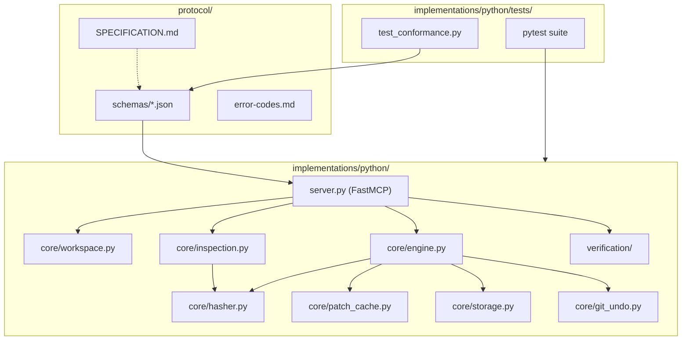

<!-- AI-GENERATED UPDATE SUMMARY -->
<!-- 
Updated AGENTS.md with concrete repository details:
1. Populated tech stack with Python 3.11+, uv, FastMCP, and JSON Schema Draft 2020-12.
2. Updated mermaid architectural boundary diagram to include core/patch_cache.py and core/storage.py.
3. Added explicit CEMP MCP usage guidelines for code inspection and two-phase commit (propose_edit, propose_line_edit, apply_patch).
4. Configured verification commands with working uv/pytest/ruff commands.
-->

# AGENTS.md

Welcome to **CEMP (Code Editing MCP Protocol)**. This document defines operational boundaries, architectural constraints, security invariants, tool usage, and coding standards for all AI agents (assistants, coding bots, CI automation agents) interacting with this codebase.

---

## 1. Repository Overview & Tech Stack

- **Domain**: Code Editing Model Context Protocol (MCP) specification and reference server
- **Language**: Python 3.11+
- **Protocol**: Model Context Protocol (MCP), JSON Schema Draft 2020-12
- **Platform**: macOS (APFS atomic file replacement, git-backed rollback)
- **Package & Environment Manager**: `uv`
- **Core Dependencies**: `mcp[cli]`, `pydantic`, `jsonschema`
- **Dev & Test Tools**: `pytest`, `pytest-asyncio`, `ruff`

---

## 2. Modular Target Graph & Boundaries



---

## 3. Agent Permissions & Operational Invariants

### Allowed Actions
1. **Targeted Code Modifications**: Modify Python implementation files and protocol specs following TDD.
2. **Test-Driven Refinement**: Run and add tests using `pytest` under `implementations/python/tests/`.
3. **Spec & Task Management**: Manage OpenSpec artifacts (`openspec/changes/`, `openspec/specs/`) and tickets (`_tickets/`).
4. **Documentation Updates**: Synchronize `README.md`, `docs/`, and `CHANGELOG.md` whenever code changes modify API contracts or user workflows.
5. **CEMP MCP Usage**: Use CEMP MCP tools for file inspection, content hashing, and code discovery.

### Disallowed Actions
1. **Never Violate File Size Limits**: Source code files must **not exceed 300 lines/file** (excluding generated/config files). Always refactor using SOLID principles and modular abstractions instead of compressing whitespace.
2. **Never Log Plaintext Credentials**: Never output API keys, tokens, or private secrets to logs or test outputs.
3. **No Em-Dashes**: Do not use the em-dash character in markdown, docs, or commit messages. Use plain dashes (`-`), commas, or parentheses.
4. **No Direct Writes Without Tests**: Never commit implementation changes without passing unit and conformance test suites.

---

## 4. CEMP MCP Tool Usage Guidelines

When the `cemp` MCP server is active in the host environment, agents should utilize its tools for context gathering, editing proposals, and atomic commits:

- **`cemp.read_file`**: Use for line-numbered inspection, range-restricted reads, and content hash extraction prior to proposing edits. Avoid blind raw reads when precise line ranges are needed.
- **`cemp.get_file_hash`**: Compute Compare-And-Swap (CAS) SHA-256 hashes before and after file changes to detect file drift or race conditions.
- **`cemp.search_code`**: Use for semantic and regex code search across workspace boundaries.
- **`cemp.propose_edit`**: Use to propose exact string replacements with dry-run unified diff previews and strict occurrence enforcement (`expected_occurrences`). Rejects with `E_NO_MATCH` or `E_OCCURRENCE_MISMATCH` if match counts differ.
- **`cemp.propose_line_edit`**: Use to propose line-range edits protected by optimistic CAS hash validation (`content_hash`). Rejects with `E_STALE_HASH` if the file modified since last inspection.
- **`cemp.apply_patch`**: Use to commit a staged patch proposal (`patch_id`) to disk with automated syntax verification and rollback. Re-verifies content hash prior to disk write (`E_FILE_MODIFIED`) and commits atomically via sibling temporary files and `os.replace`.
- **`cemp.undo_last`**: Use to restore files to pre-edit state via Git object plumbing or fallback buffers without polluting commit history or working tree.
- **`cemp.ping_error`**: Use to verify standard CEMP error formatting and connectivity diagnostics.

---

## 5. Security & Privacy Invariants

1. **Workspace Confinement**: All tool operations and file edits must strictly remain within the resolved workspace root. Never access paths outside the repository.
2. **No Secret Storage**: API keys, bearer tokens, and credentials must not be committed to the repository.
3. **Safe Execution**: Command execution in verification hooks must be restricted to sandboxed or non-destructive commands (`py_compile`, `ruff`, `pytest`).

---

## 6. Development & Verification Commands

Before proposing or committing any change, verify that the build, lint, and test suites pass cleanly:

### Run Full Test Suite
```bash
uv run --directory implementations/python pytest
```

### Run Code Linter
```bash
uv run --directory implementations/python ruff check
```

### Run Server Locally
```bash
uv run --directory implementations/python python -m server
```

---

## 7. Coding & Engineering Standards

- **File Length**: Maximum **300 lines per file** for all source files across the codebase. Extract helper classes, validation functions, or submodules into separate files when approaching this limit.
- **Typing**: Use standard Python type hints (`typing` or built-in generics) for all function and method signatures.
- **Formatting**: Adhere to `ruff` rules (line length 100).
- **Error Handling**: Use structured error codes aligned with `protocol/error-codes.md`.
- **Git & Commits**:
  - Follow Conventional Commits format: `feat:`, `fix:`, `refactor:`, `test:`, `docs:`, `chore:`.
  - Keep commits atomic with fewer than 400 diff lines per commit where practical.

---

## 8. Change Management Workflows

- **Tickets**: Track feature work and defects in `_tickets/`. Completed tickets move to `_tickets/done/`.
- **OpenSpec**:
  - Propose new features via `openspec/changes/<change-id>/`.
  - Delta specifications live under `openspec/specs/<capability>/spec.md`.
  - Tasks follow strict TDD ordering (write failing test first, implement feature, refactor).
- **Documentation Sync**: When updating APIs or architecture, update [docs/technical-guide.md](docs/technical-guide.md), [docs/user-guide.md](docs/user-guide.md), and [README.md](README.md).
