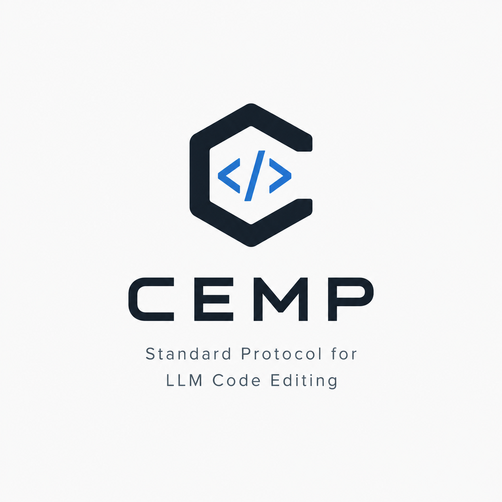
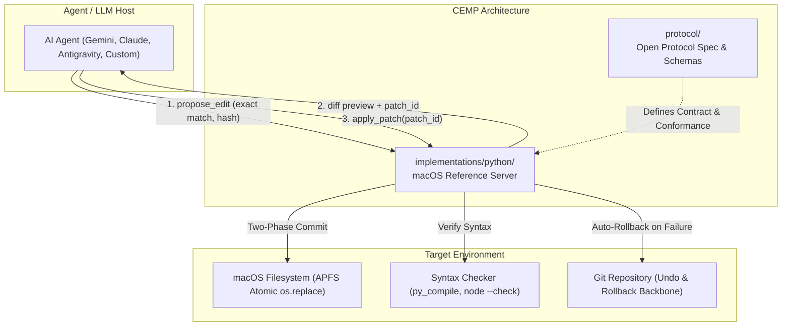

# CEMP (Code Editing MCP Protocol)

An open, versioned specification for reliable LLM code editing, paired with a provider-agnostic macOS reference implementation in Python.

---

## Overview

AI coding agents commonly rely on raw text-stream utilities like `grep`, `sed`, and `awk` for code modifications. These tools suffer from silent mis-edits, lack of dry-run diffs, race conditions, and no syntax safety nets.

**CEMP** solves this by establishing an open Model Context Protocol (MCP) standard that decouples edit proposals from disk commits, provides atomic multi-file transactions, and automates syntax verification with git-backed rollback.

---

## Core Capabilities at a Glance

Full specifications, schemas, and API shapes are detailed in the [Technical Guide](docs/technical-guide.md).

| Capability | Summary | Guarantee |
|---|---|---|
| **1. Read & Inspection** | Line-numbered reads, semantic regex search, content hashing | Eliminates off-by-one errors; establishes CAS baseline |
| **2. Multi-Strategy Patching** | Exact string match, line-range with CAS, and AST-aware edits | Strict occurrence counts; loud failures over silent edits |
| **3. Two-Phase Commit** | Proposal creates diff preview and `patch_id` without touching disk | Verifiable dry-run before any physical filesystem write |
| **4. Multi-File Transactions** | `begin_transaction`, staged patches, atomic commit/rollback | All-or-nothing multi-file refactoring without partial state |
| **5. Verification Hooks** | Automated syntax checks (`py_compile`, `node --check`) and tests | Auto-rollback on compiler/test failure before agent proceeds |
| **6. Git-Backed Undo** | Instant patch reversion via local working tree integration | Safe state recovery without proprietary snapshot buffers |

For deep-dive mechanics and code examples, see [docs/technical-guide.md](docs/technical-guide.md#2-core-protocol-capabilities--tool-specifications).

---

## System Architecture



---

## Why CEMP Beats sed/awk

| Failure Mode | sed / awk / grep | CEMP Protocol Guarantee |
|---|---|---|
| Ambiguous matches | Silently edits wrong line or all occurrences | Strict `expected_occurrences` enforcement (fails loudly) |
| Blind writes | Writes directly to disk | Two-phase commit: unified diff preview before write |
| Concurrent drift | Silent clobbering | Content-hash compare-and-swap guard |
| Broken syntax | Leaves broken code on disk | Post-apply syntax hooks with automatic rollback |
| Platform differences | BSD `sed` vs GNU `sed` incompatibility | Provider-agnostic, stdlib-backed Python execution |
| Partial refactors | Multi-file edits left half-applied on error | Git-backed undo and atomic file replacement |

---

## Repository Structure

```text
CEMP/
├── protocol/                      # Tech-agnostic reference specification
│   ├── schemas/                   # JSON Schema Draft 2020-12 tool contracts
│   ├── SPECIFICATION.md           # Normative specification (RFC 2119 & behavioral contracts)
│   └── error-codes.md             # Registry of standardized CEMP error codes
├── implementations/
│   └── python/                    # Provider-agnostic macOS Python reference implementation
│       ├── server.py              # FastMCP server entrypoint
│       ├── core/                  # Safe edit engine (diffing, CAS, APFS atomic replace)
│       ├── verification/          # Syntax verification hooks (py_compile, node --check)
│       └── tests/                 # pytest test suite & conformance validator
├── docs/                          # Guides, design records, and idea documents
│   ├── technical-guide.md         # Detailed developer & protocol guide
│   └── user-guide.md              # Setup and agent configuration manual
├── AGENTS.md                      # Operational rules and coding invariants for AI agents
├── CHANGELOG.md                   # Release history
└── README.md                      # Project summary & entry point
```

---

## Getting Started

### Prerequisites
- macOS (tested on macOS 14 Sonoma and macOS 15 Sequoia)
- Python 3.11+
- `git` installed and initialized in target repositories

### Installation & Local Run

```bash
# Clone the repository
git clone https://github.com/korakot/CEMP.git
cd CEMP

# Run reference server via uv
uv run --directory implementations/python python -m server
```

### Agent Host Configuration (MCP)

Add the reference server to your MCP host configuration (e.g. Claude Desktop, Antigravity, Gemini agent harnesses):

```json
{
  "mcpServers": {
    "cemp": {
      "command": "uv",
      "args": [
        "run",
        "--directory",
        "/path/to/CEMP/implementations/python",
        "python",
        "-m",
        "server"
      ]
    }
  }
}
```

---

## Verification & Conformance

Verify that the reference implementation conforms to the protocol specification:

```bash
# Run tests
pytest implementations/python/tests/
```

---

## Documentation & References

- [Technical Guide](docs/technical-guide.md): Complete specifications for the 6 core capabilities, contracts, and atomic mechanics.
- [User Guide](docs/user-guide.md): Setup, configuration, and agent integration recipes.
- [Agent Guidelines](AGENTS.md): Operational rules, coding standards, and repository invariants.
