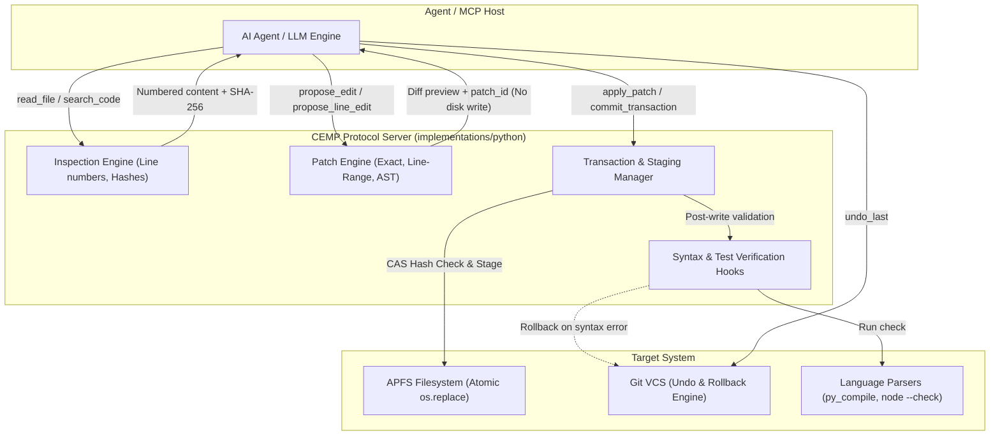

# CEMP Technical, Developer & Architecture Guide

This document provides a comprehensive technical reference for engineers, system architects, and AI agent developers building or integrating with the Code Editing MCP Protocol (CEMP).

---

## Table of Contents

1. [Architecture & Component Model](#1-architecture--component-model)
2. [Core Protocol Capabilities & Tool Specifications](#2-core-protocol-capabilities--tool-specifications)
   - [2.1 Read and Inspection Tools](#21-read-and-inspection-tools)
   - [2.2 Patch Construction Strategies](#22-patch-construction-strategies)
   - [2.3 Two-Phase Commit Pattern](#23-two-phase-commit-pattern)
   - [2.4 Batch and Transactional Multi-File Edits](#24-batch-and-transactional-multi-file-edits)
   - [2.5 Verification Hooks and Automated Rollback](#25-verification-hooks-and-automated-rollback)
   - [2.6 State Recovery and Git-Backed Undo](#26-state-recovery-and-git-backed-undo)
3. [File System Safety & Atomic Operations](#3-file-system-safety--atomic-operations)
4. [Reference Implementation Details](#4-reference-implementation-details)
5. [Linting, Testing & Verification Standards](#5-linting-testing--verification-standards)

---

## 1. Architecture & Component Model

CEMP replaces error-prone shell utilities (`sed`, `awk`, in-place regex) with a structured, verified protocol for autonomous and human-supervised code editing.



---

## 2. Core Protocol Capabilities & Tool Specifications

### 2.1 Read and Inspection Tools

Inspection tools provide prerequisite ground-truth context to the LLM before any edit proposal.

```text
read_file(path: str, line_range?: Tuple[int, int]) -> {
    lines: List[Tuple[int, str]],
    content_hash: str,
    total_lines: int
}

search_code(pattern: str, path_glob: str, regex: bool = False, context_lines: int = 3) -> {
    matches: List[{file: str, line: int, match: str, context: List[str]}]
}

get_file_hash(path: str) -> str  # SHA-256 for optimistic concurrency
```

- **Line-Numbered Reads**: Crucial for eliminating off-by-one errors when the LLM targets specific code blocks.
- **Content Hash Generation**: Computes a SHA-256 digest of file contents at read time, establishing a baseline for Compare-And-Swap (CAS) validation during patch application.
- **Context-Rich Code Search**: Finds unique strings and structural landmarks with surrounding context to avoid blind pattern guessing.

---

### 2.2 Patch Construction Strategies

CEMP supports three complementary patching mechanisms to handle different code patterns and languages.

#### Strategy A: Exact String Replacement (Primary Workhorse)

Used for approximately 90% of code edits.

```python
propose_edit(
    path: str,
    old_str: str,
    new_str: str,
    expected_occurrences: int = 1
) -> {
    "status": "ok" | "no_match" | "ambiguous_match",
    "match_count": int,
    "diff_preview": str,  # Unified diff
    "patch_id": str
}
```

- **Strict Occurrence Check**: `old_str` must match **exactly once** unless `expected_occurrences` is explicitly provided.
- **Loud Failures**: If `old_str` is ambiguous or not found, the server fails loudly with actual match locations rather than silently modifying incorrect lines or all occurrences.
- **Forced Context**: Demands sufficient surrounding code in `old_str` to uniquely anchor the replacement.

#### Strategy B: Line-Range Replacement with CAS Guard

Used when exact string matching is fragile, such as heavily reformatted code or whitespace-sensitive languages (Python, YAML).

```python
propose_line_edit(
    path: str,
    start_line: int,
    end_line: int,
    new_content: str,
    content_hash: str
) -> {
    "status": "ok" | "hash_mismatch" | "invalid_range",
    "diff_preview": str,
    "patch_id": str
}
```

- **Compare-And-Swap (CAS) Guard**: The edit is accepted only if `content_hash` matches the current file hash on disk. If another tool, human, or build process mutated the file in the interim, the proposal fails immediately to prevent clobbering.

#### Strategy C: Structural and AST-Aware Edits (Advanced Tier)

Targets semantic nodes rather than raw text.

```python
propose_ast_edit(
    path: str,
    node_selector: str,  # e.g., "function[name='process_payment'].body"
    new_code: str
) -> {
    "status": "ok" | "node_not_found" | "syntax_error",
    "diff_preview": str,
    "patch_id": str
}
```

- **Tree-sitter Integration**: Selects syntax tree targets (e.g. body of function `foo`, third argument of call `bar`).
- **Syntax Invariant Protection**: Eliminates mismatched indentation, unbalanced braces, and broken grammar constructs.

---

### 2.3 Two-Phase Commit Pattern

To prevent disk corruption, CEMP explicitly separates patch computation from disk mutation.

```text
Step 1 (Proposal):
  propose_edit(...) -> returns patch_id + diff_preview (DOES NOT TOUCH DISK)

Step 2 (Validation / Review):
  LLM or human inspects diff_preview generated by server (not hallucinated by LLM)

Step 3 (Commit):
  apply_patch(patch_id) -> writes to disk only if target file hash matches pre-conditions
```

- **Why it matters**: `sed` and `awk` execute blind mutations directly against disk. In contrast, CEMP generates an ephemeral unified diff computed server-side via `difflib`. The agent or host has an explicit checkpoint to review the exact patch before disk writes occur.

---

### 2.4 Batch and Transactional Multi-File Edits

Refactoring frequently requires synchronized changes across multiple files (e.g., renaming a signature and updating all import/call sites).

```python
begin_transaction() -> tx_id

apply_patch(patch_id: str, tx_id: str)  # Stages change in memory/staging dir

commit_transaction(tx_id: str) -> {
    "status": "committed",
    "files_updated": List[str]
}

rollback_transaction(tx_id: str) -> {
    "status": "rolled_back"
}
```

- **All-or-Nothing Guarantees**: If file 4 of 6 fails hash validation or syntax verification, none of the files are committed to disk.
- **Staging Implementation**: Changes stage in a temporary workspace or via APFS clones, followed by coordinated atomic `os.replace` swaps.

---

### 2.5 Verification Hooks and Automated Rollback

Preventing broken code on disk requires immediate post-write validation.

```python
run_syntax_check(path: str) -> {
    "valid": bool,
    "errors": List[str]
}

run_tests(test_selector?: str) -> {
    "passed": bool,
    "output": str
}
```

- **Language-Appropriate Checkers**: Automatically uses `py_compile` for Python, `node --check` for JavaScript, `tsc --noEmit` for TypeScript, and standard compilers for Go/Rust.
- **Auto-Rollback on Failure**: When configured, `apply_patch` executes `run_syntax_check` immediately after writing. If syntax fails, the patch automatically reverts via the git backbone and returns compiler errors to the agent.

---

### 2.6 State Recovery and Git-Backed Undo

```python
undo_last(path?: str) -> {
    "status": "reverted",
    "reverted_patch_id": str,
    "current_hash": str
}
```

- **Git Backbone**: Uses the local git repository working tree as the authoritative undo store rather than maintaining ad-hoc snapshot ring buffers.
- **Safe Reversion**: Allows an agent to step backward instantly if runtime checks, tests, or user reviews fail.

---

## 3. File System Safety & Atomic Operations

On macOS (APFS), writes utilize atomic replacement semantics:
1. The new content is written to a temporary sibling file in the same directory (`path + ".cemp.tmp"`).
2. The file is flushed to physical disk (`flush()` followed by `os.fsync()`).
3. An atomic rename (`os.replace()`) swaps the temporary file into the target path.

This guarantees that power outages, agent crashes, or concurrent reads never encounter truncated or partially written files.

---

## 4. Reference Implementation Details

The reference server is implemented in `implementations/python/` using FastMCP:

- `core/engine.py`: Implements `read_file`, `propose_edit`, `propose_line_edit`, and patch cache management.
- `core/hasher.py`: Computes consistent SHA-256 digests.
- `verification/syntax.py`: Language-specific syntax checking adapters.
- `core/transactions.py`: Transaction manager for multi-file operations.

---

## 5. Linting, Testing & Verification Standards

To verify changes in the reference implementation:

```bash
# Run test suite
pytest implementations/python/tests/

# Verify code formatting and linting
ruff check implementations/python/
ruff format --check implementations/python/
```

All modifications to protocol specifications or reference implementations must maintain 100% pass rates across existing unit tests and conformance tests.
