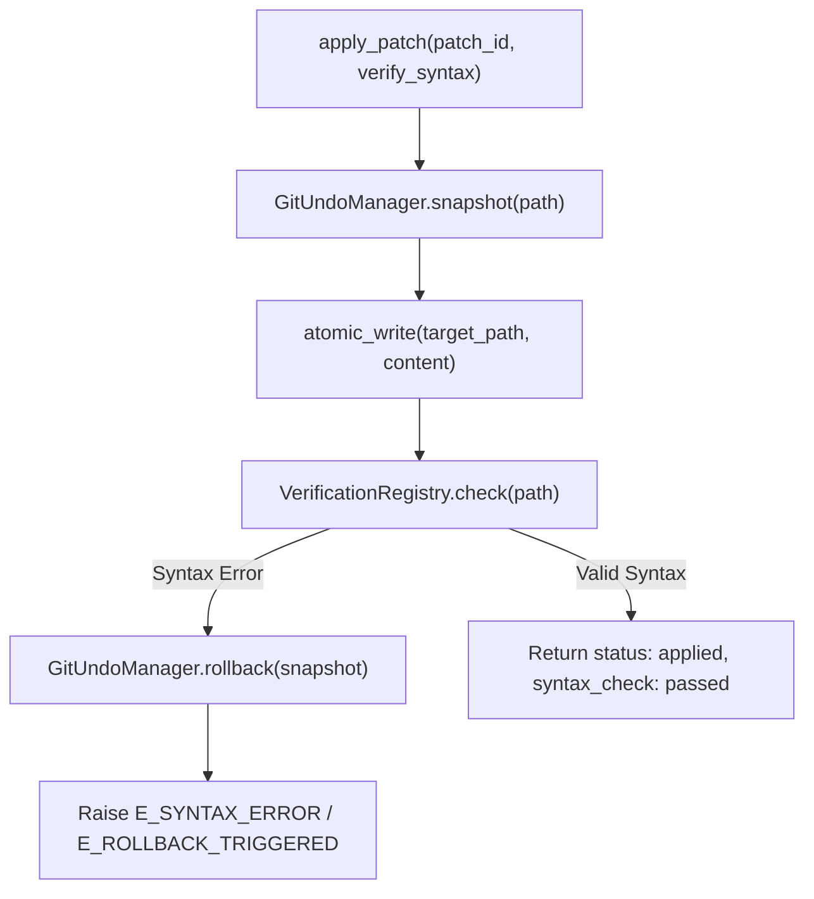

## Context

See [proposal.md](./proposal.md) for motivation and problem background.

Currently, CEMP provides two-phase commit editing via `propose_edit`, `propose_line_edit`, and `apply_patch`. However, edits that introduce syntax errors or broken grammar remain written on disk, requiring manual fix-up or external git commands. Furthermore, modifying git state through high-level porcelain commands (`git checkout`, `git commit`, `git stash`) pollutes the user's reflog, commit history, and stash stack, creating risk of merge conflicts and dirty index corruption.

## Goals / Non-Goals

**Goals:**
- Zero Git history pollution: Capture pre-write snapshots as loose Git blobs (`git hash-object -w`) without moving `HEAD`, touching the index, or adding commits.
- Automated safety net: Run language-specific syntax checks immediately following atomic replacement in `apply_patch`; automatically roll back file state on syntax errors and return compiler diagnostics.
- Explicit undo control: Provide an `undo_last` tool that reverts the most recent applied patch for a specific file or globally across the workspace.
- Fallback resilience: Support non-git workspaces transparently via fallback in-memory/disk backups.
- Strict file modularity: Keep all newly added source files under the 300 lines/file limit.

**Non-Goals:**
- Project-wide type checking (e.g. `mypy`, `tsc --noEmit`) or running full test suites (`pytest`), which are high-latency operations reserved for explicit verification commands.
- Multi-file atomic git commit creation or git branching workflows.
- Arbitrary undo tree branching beyond sequential LIFO patch unwinding.

## Architecture & Data Flow

## Decisions

### 1. Low-Level Git Plumbing (`hash-object` / `cat-file`) over Porcelain Commands
- **Decision**: Store pre-edit file states using `git hash-object -w <path>` and retrieve them via `git cat-file -p <object_id>`.
- **Rationale**: Loose object writes are completely decoupled from Git working tree tracking (`git status`), staging index (`.git/index`), `HEAD`, and reflog. Git garbage collection (`git gc`) cleans up unreferenced blobs automatically over time.
- **Alternatives Considered**:
  - `git stash push / pop`: Discarded because stash touches developer index state and can cause merge conflicts during pop.
  - Scratch temporary commits: Discarded because it creates branch clutter and invalidates commit history.

### 2. Extensible Verification Registry with Sub-Millisecond Default Checkers
- **Decision**: Introduce a `VerificationRegistry` in `verification/registry.py` that maps file extensions to language checkers.
  - Python: Use standard library `py_compile.compile(path, doraise=True)` in-process or via lightweight runner for sub-millisecond AST validation.
  - JavaScript: Check for `node` binary; execute `node --check <path>` via subprocess.
  - Unknown/unsupported languages: Return passed with `checker: "none"`.
- **Rationale**: Syntax checking must be sub-10ms to prevent perceptible latency during agent editing loops.
- **Alternatives Considered**:
  - AST parsing via tree-sitter or external linters: Discarded due to heavy dependency footprints and setup complexity. Standard library `py_compile` has zero external dependencies.

### 3. Immediate Automatic Rollback on Syntax Failure in `apply_patch`
- **Decision**: When `verify_syntax=True` (the default) and the post-write syntax check fails, `apply_patch` immediately reverts the file from the pre-write snapshot and raises error `-32040` (`E_SYNTAX_ERROR`) or `-32042` (`E_ROLLBACK_TRIGGERED`) with error details and compiler stderr diagnostics.
- **Rationale**: Agents receive immediate feedback about the syntax error without leaving broken code on disk, maintaining an always-syntactically-valid working tree.
- **Alternatives Considered**:
  - Leave broken file on disk and return a warning: Discarded because broken files break running dev servers, test runners, and downstream agent turns.

### 4. Stack-Based Undo History for `undo_last`
- **Decision**: Store applied patch snapshot metadata in an in-memory LIFO stack managed by `GitUndoManager`. If `path` is specified, pop the most recent patch targeting that path; otherwise pop the globally top patch.
- **Rationale**: Provides predictable, deterministic reversions matching agent mental models.
- **Alternatives Considered**:
  - Persisting undo history in SQLite: Overkill for session-scoped editing workflows; memory stack is fast and simple.

## Risks / Trade-offs

- **[Risk] Working tree in non-git directory** -> Mitigation: `GitUndoManager` checks if target is inside a git worktree; if not, writes backup bytes to an in-memory buffer or `.cemp.bak` sibling file.
- **[Risk] `node` executable not installed for JS files** -> Mitigation: `NodeChecker` probes `shutil.which("node")`; if absent, skips check gracefully and logs a debug notice.
- **[Risk] Concurrent edits outside the server during verification** -> Mitigation: Verification and rollback happen within a microsecond window; rollback uses atomic sibling replacement (`os.replace`) to avoid partial writes.
