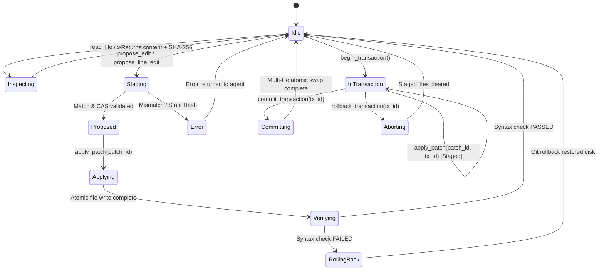

# CEMP (Code Editing MCP Protocol) Specification
**Version:** 1.0.0-draft  
**Status:** Working Draft  

---

## 1. Introduction & Conformance

The Code Editing MCP Protocol (CEMP) defines a standard, state-verified contract for autonomous AI agents and developer tools to safely inspect, stage, patch, verify, and revert modifications across source code filesystems.

### 1.1 Key Words for Use in RFCs (RFC 2119 / RFC 8174)
The key words "MUST", "MUST NOT", "REQUIRED", "SHALL", "SHALL NOT", "SHOULD", "SHOULD NOT", "RECOMMENDED", "NOT RECOMMENDED", "MAY", and "OPTIONAL" in this document are to be interpreted as described in BCP 14 [RFC2119] [RFC8174] when, and only when, they appear in all capitals, as shown here.

### 1.2 Core Architectural Principles
1. **Separation of Proposal from Mutation:** File edits MUST NOT write directly to target files without prior generation and validation of a patch proposal.
2. **Deterministic Grounding:** Edits MUST anchor to concrete content hashes (Compare-And-Swap) or strict match occurrences to eliminate drift and misaligned edits.
3. **Atomic Commit Guarantee:** Physical disk modifications MUST employ all-or-nothing atomic replacement to prevent truncated, corrupted, or partially applied states.
4. **Verification with Automated Rollback:** Systems SHOULD validate syntax and test invariants immediately after write, rolling back state upon failure before releasing control.

---

## 2. Protocol Lifecycle & State Machine

### 2.1 State Transitions
- **Idle:** Server is ready for inspection queries or proposals.
- **Staging / Proposed:** Server computes unified diffs in memory using `difflib`. The physical disk remains unmodified. A `patch_id` with a default Time-To-Live (TTL) of 15 minutes is issued.
- **Applying / Verifying:** When `apply_patch` is invoked, the server re-validates the target file's current hash against pre-conditions. Upon match, the server applies changes atomically and triggers verification hooks.
- **InTransaction:** Patches targeted to a `tx_id` stage in an isolated staging space. No target files are swapped until `commit_transaction` is invoked.

---

## 3. Normative Behavioral Contracts

### 3.1 Occurrence Count Contract
When evaluating `propose_edit(path, old_str, new_str, expected_occurrences)`:
1. The server MUST count exact literal occurrences of `old_str` in the target file.
2. If `expected_occurrences` is omitted, it MUST default to `1`.
3. If the actual occurrence count is `0`, the server MUST fail loudly with error `E_NO_MATCH (-32000)`.
4. If the actual occurrence count does not equal `expected_occurrences`, the server MUST fail loudly with error `E_OCCURRENCE_MISMATCH (-32001)` and MUST include the line numbers of all detected matches in `data.matches`.
5. The server MUST NOT apply partial replacements or modify ambiguous targets silently.

### 3.2 Compare-And-Swap (CAS) Hash Contract
When evaluating `propose_line_edit(path, start_line, end_line, new_content, content_hash)` or committing patches:
1. The server MUST compute the SHA-256 digest of the current file content on disk.
2. If `content_hash` does not match the current digest, the server MUST reject the proposal or commit with `E_STALE_HASH (-32010)`.
3. The server MUST return the current hash in the error payload so the client can re-read and rebase without guessing.

### 3.3 Atomic Disk Write Contract
When writing committed patches to physical storage:
1. The server MUST write the modified content to a temporary sibling file within the same filesystem directory (`<path>.<uuid>.cemp.tmp`).
2. The server MUST flush write buffers and call `fsync` on the temporary file before replacement.
3. The server MUST replace the target path using atomic filesystem primitives (`os.replace` on POSIX/macOS systems).
4. The server MUST NOT write content via non-atomic in-place truncation (`open(path, 'w')`).

### 3.4 Verification & Auto-Rollback Contract
When verification hooks are enabled:
1. Conforming servers SHOULD invoke language-specific syntax parsers (`py_compile` for Python, `node --check` for JavaScript, `tsc --noEmit` for TypeScript) immediately following the atomic swap.
2. If syntax verification fails:
   - The server MUST restore the target file to its pre-patch state using the local git working tree or atomic backup.
   - The server MUST return error `E_SYNTAX_ERROR (-32040)` or `E_ROLLBACK_TRIGGERED (-32042)` including compiler stderr diagnostics.
   - The server MUST NOT leave broken syntax on disk.

---

## 4. Tool Interface Contracts

Conforming CEMP servers MUST implement the following tool operations. Complete schemas are located in `protocol/schemas/`.

### 4.1 Inspection Tools
- **`read_file(path: string, line_range?: [number, number])`**:
  Returns 1-indexed lines, total line count, and current SHA-256 `content_hash`.
- **`search_code(pattern: string, path_glob: string, regex?: boolean, context_lines?: number)`**:
  Finds pattern occurrences with surrounding context lines.
- **`get_file_hash(path: string)`**:
  Computes SHA-256 digest of file for optimistic concurrency checking.

### 4.2 Patching Tools (Two-Phase Commit)
- **`propose_edit(path: string, old_str: string, new_str: string, expected_occurrences?: number)`**:
  Validates occurrence counts, generates a unified diff preview, caches patch in memory, and returns `patch_id`. Does NOT touch disk.
- **`propose_line_edit(path: string, start_line: number, end_line: number, new_content: string, content_hash: string)`**:
  Validates 1-indexed bounds and CAS hash, generates unified diff preview, and returns `patch_id`. Does NOT touch disk.
- **`apply_patch(patch_id: string, tx_id?: string)`**:
  Applies `patch_id` to disk (or stages inside transaction `tx_id`). Executes CAS re-verification, atomic disk replacement, and post-write syntax hooks.

### 4.3 Transaction Management Tools
- **`begin_transaction()`**:
  Initializes an isolated multi-file transaction and returns `tx_id`.
- **`commit_transaction(tx_id: string)`**:
  Atomically validates and swaps all staged files in the transaction. If any file fails verification, all staged changes are discarded.
- **`rollback_transaction(tx_id: string)`**:
  Discards all staged edits for `tx_id` without modifying physical files.

### 4.4 Recovery Tools
- **`undo_last(path?: string)`**:
  Reverts the most recent applied patch using git working tree integration. Returns reverted patch ID and post-reversion content hash.

---

## 5. Security & Safety Invariants

1. **Path Traversal Protection:** Servers MUST resolve paths against permitted workspace root directories. Requests attempting to navigate above workspace roots (`../`) MUST be rejected with `E_PATH_TRAVERSAL (-32050)`.
2. **Symlink Resolution:** Servers MUST resolve symlinks safely and MUST NOT follow symlinks pointing outside permitted workspace boundaries.
3. **Sensitive File Blacklist:** Servers MUST reject edit operations targeting VCS internal databases (`.git/`), credential stores (`.env`), or private keys unless explicitly overridden by configuration.
